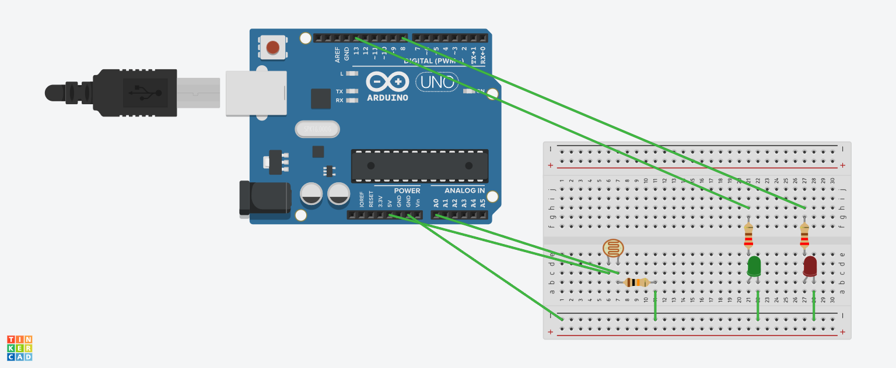

# Photoresistor
## Circuit Simulation
The circuit was simulated in Tinkercad before being built and tested on physical hardware.

[View the Tinkercad simulation](https://www.tinkercad.com/things/hpUlirGeJmU-photoresistor?sharecode=HIp9zYJ_OAx5kK3JpYkGZXU0Z1I4a1Y9Pge7GbGa5-E)

## How The Photoresistor Works

This project uses a photoresistor (LDR) and a 10 kΩ resistor to form a voltage divider. The photoresistor changes resistance according to the amount of light reaching it, producing a changing voltage at the junction of the divider. This voltage is read by the Arduino's A0 analogue input using analogRead(), producing a value between 0 and 1023.

The program compares the measured light level against a threshold of 800. When the reading is below 800, the red LED is illuminated to indicate a lower light level. When the reading is 800 or above, the green LED is illuminated to indicate a higher light level. The sensor value and LED status are also displayed through the Serial Monitor.

## Physical Hardware

## Demonstration

[▶️ View photoresistor demonstration](./20260825_084647_1.mp4)
