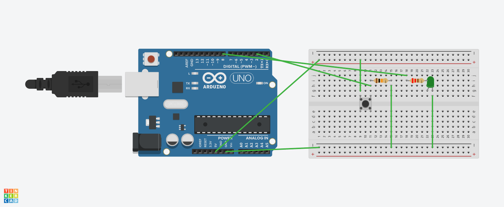
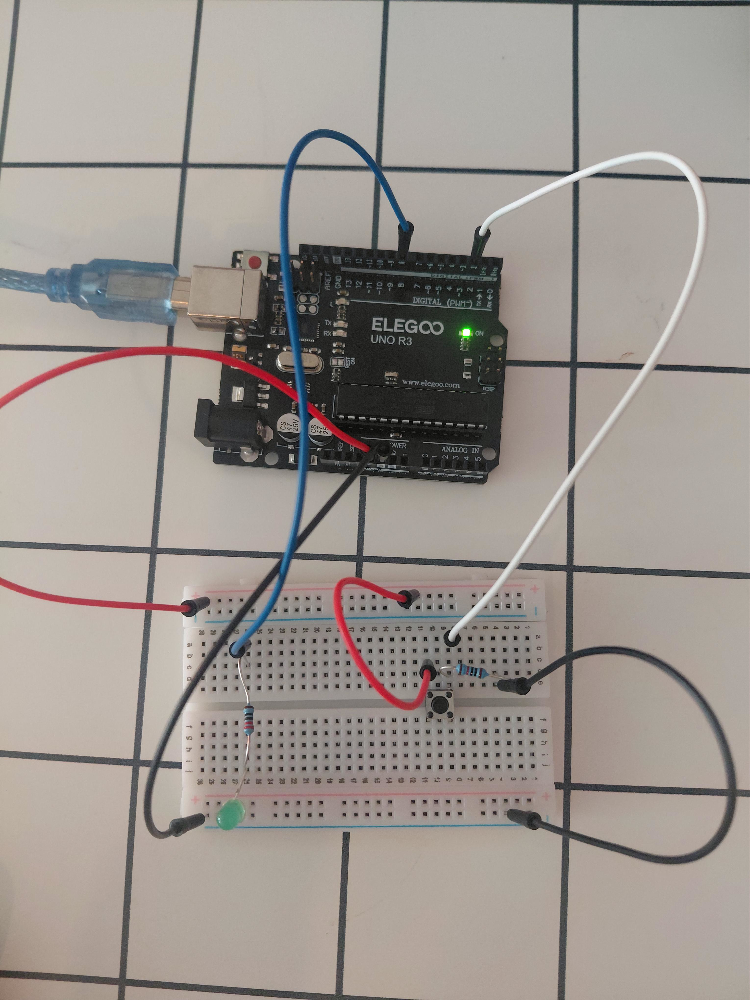
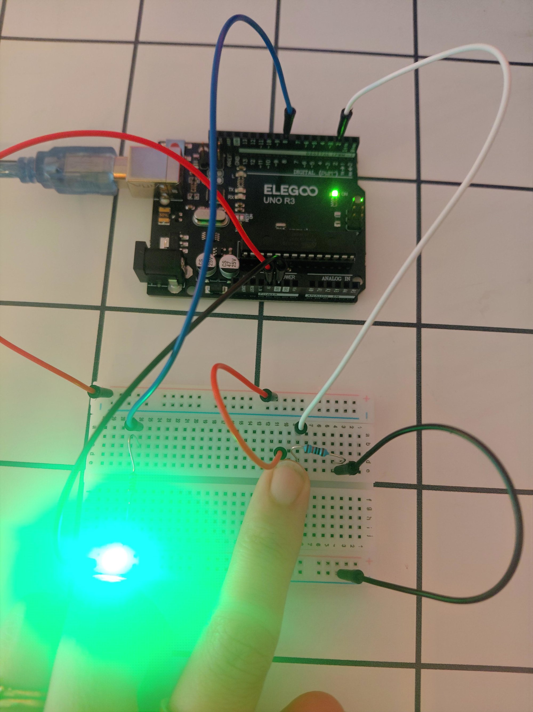

# Pull-Down Resistor

## Circuit Simulation

The circuit was simulated in Tinkercad before being built and tested on physical hardware.

[View the Tinkercad simulation](https://www.tinkercad.com/things/hrtsQjeC9uq-fabulous-robo?sharecode=wZiKHIm5UogBck85mjkGSdbr4awecr1RFZg-hlR47pA)

## How the Pull-Down Resistor Works

The circuit uses a 10 kΩ pull-down resistor to give the Arduino digital input a defined default state. When the button is not pressed, the resistor connects the input to GND, so the Arduino reads LOW. When the button is pressed, the input is connected to the 5 V supply, so the Arduino reads HIGH and switches the LED on.

Without a pull-down or pull-up resistor, the input can be left in a floating state. This means the input is not firmly connected to either HIGH or LOW. It can therefore pick up electrical noise or interference and produce an unpredictable reading, potentially causing the Arduino to think the button has been pressed when it hasn't. The pull-down resistor prevents this by giving the input a known LOW state whenever the button is open.

## Physical Hardware

*Physical circuit built and tested on an Elegoo UNO R3.*

*Button pressed in circuit, LED powered ON.*

## Arduino Code

The Arduino sketch used to control the LED is included in
[`pull-down-resistor-led.ino`](pull-down-resistor-led.ino).

## Components

- Arduino Uno
- Breadboard
- Push button
- 10 kΩ resistor
- 220 Ω resistor
- LED
- Jumper wires

